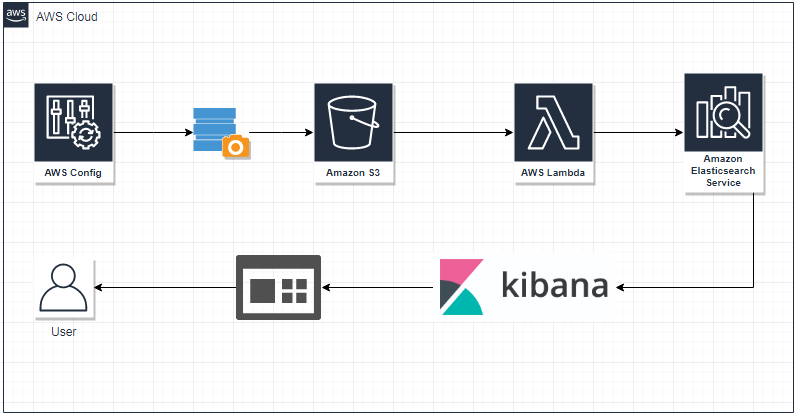

# AWS Config Compliance information in Dashoard using AWS Elastic Search and Kibana (Work in progress)

Visualize AWS Config Compliance information in Dashoard using AWS Elastic Search and Kibana.


## What resources are created

1. VPC
2. Internet Gateway (IGW)
3. Public and Private Subnets
4. Security Groups, Route Tables and Route Table Associations
5. IAM roles, instance profiles and policies
6. An Elastic Search Service Cluster
9. lambda funtion for wiring Kibana and Cognito, for transfer AWS Config Snapshot to Elastic Search
10. Cognito User pool, Identity Pool (Optional)
11. S3 Event (Work in progess)
12. Lambda Layer (Compatible for Python 3.7)


----

## How to use this example

## Pre-resuisite

1. Python v3.7
2. Terraform v0.11.14
3. AWS Account (With Admin Access)


```bash
git clone git@github.com:nitinda/terraform_aws_config_on_elk.git
cd terraform_aws_config_on_elk/layer
terraform init
terraform plan
terrafomr apply --auto-approve
```


## Manual Steps post deployment (Optional)

```
- Deployed Lambda function (i.e. terraform-demo-lambda-wiringfunction) needs to be executed before accessing the kibana
    - Create test evnet, this function will create Cognito user (i.e. - kibana default password : Abcd1234!)
```

----

## Diagram




----

## Cleaning up

You can destroy this cluster entirely by running:

```bash
terraform plan -destroy
terraform destroy --force --auto-approve
```